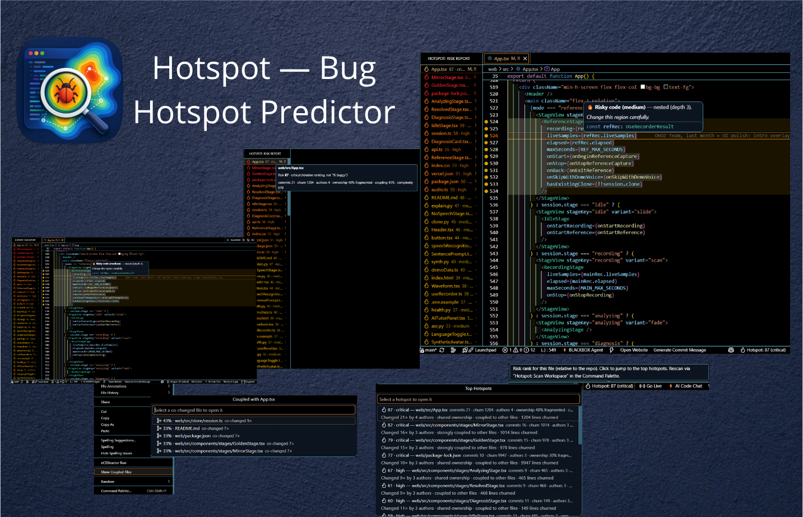

# Hotspot — Bug Hotspot Predictor

**See where bugs are likely to hide — ranked, explained, and shown inline where you code.**

CodeScene-style **churn × complexity** bug-risk prediction — but free, 100% offline, and shown right in your editor. Hotspot ranks the files in your repository by how **bug-prone** they are, fusing six evidence-backed history signals — change frequency, code churn, **recency**, author spread, **code ownership**, and **change coupling** — shaped by complexity and bug-fix history into a single 0–100 risk score, then localizes the danger down to the **risky code regions** inside each file.

> ### "Bug hotspot" ≠ "security hotspot"
> Hotspot flags files that are *statistically likely to contain defects*, based on how they have changed over time. It is **not** a security scanner — it does **not** identify security-sensitive code the way SonarLint's "security hotspots" do.

---

## Features

- **Risk Report panel** — a dedicated activity-bar view listing the riskiest files top-down; hover a row for the per-signal breakdown, click to open the file. Each row carries a **trend badge** (↑ rising / → stable / ↓ cooling) and the view warns when the git history is too thin to rank confidently.
- **Code-level risk highlights** — risky code *regions* (deeply-nested / long blocks) get a gutter marker, a faint tint, and a hover that explains **why** — in any open file, of any tier. Tune with `hotspot.codeRiskEnabled` / `hotspot.codeRiskMinSeverity`.
- **Per-region risk CodeLens** *(new)* — an inline `⚠ Risk: <severity> · depth · lines` lens above risky blocks, gated by the same minimum severity. Toggle with `hotspot.codeLensEnabled`.
- **`Hotspot: Export Risk Report`** *(new)* — export the current ranking as Markdown or JSON into a new editor, for sharing or tracking risk over time.
- **`Hotspot: Show Top Hotspots`** — a Quick Pick jump-list of the highest-risk files, each with a plain-language reason; pick one to open it instantly.
- **`Hotspot: Show Coupled Files`** — for the active file, the files that historically change *with* it ("you probably also need to edit X"). From the Command Palette **or** the editor right-click menu.
- **Explorer decorations** — a colored badge marks each file's risk tier in the Explorer.
- **Status bar** — the active file's risk score and tier at a glance; **click it to open Top Hotspots**.
- **`Hotspot: Scan Workspace`** — run from the Command Palette to (re)analyze the repository.

## Why it exists

Decades of defect-prediction research (Rahman & Devanbu, ICSE 2013) found that **how code changes** predicts bugs better than **what the code looks like** statically. Adam Tornhill's hotspot model sharpens this: a file is dangerous only when it is **both** complex **and** frequently changed — and roughly 1–2% of a codebase tends to account for ~70% of its change activity. Hotspot puts that ranking one command away.

## How the score works

For every file with git history, Hotspot fuses six process signals into an additive core, then shapes that core with complexity and bug-fix history.

**Process signals (the additive core):**

- **Change frequency** *(0.22)* — number of commits touching the file
- **Code churn** *(0.18)* — lines added + deleted
- **Recency** *(0.20)* — time-decayed change activity (`0.5 ^ (ageDays / 365)` per commit, a 365-day half-life, measured from the newest commit); files changed recently rank higher than those whose churn is all in the distant past
- **Author spread** *(0.10)* — number of distinct authors
- **Ownership fragmentation** *(0.15)* — `1 − the top author's commit share`; code spread thin across many low-share "minor contributors" (weak ownership) correlates strongly with defects (Bird et al., *Don't Touch My Code!*, 2011)
- **Change coupling** *(0.15)* — the file's strongest hidden co-change dependency (`shared commits / max(revisions)`); files that historically change together but live apart are easy to update inconsistently

**Shaping factors:**

- **Complexity** — an indentation proxy (language-agnostic, no parser), applied as a ×[0.5–1] multiplier
- **Bug-fix density** — the fraction of touching commits that were bug fixes (detected from commit messages), applied as a `(1 + density)` booster

Signals are log-dampened and min–max normalized **across your repository**, then combined into a score from 0–100 and a tier — **low / medium / high / critical**. The same complexity signal is also computed **per region** to localize risk to specific blocks inside a file (the *Code-level risk highlights* above).

> **Scores are relative rankings, not absolute probabilities.** A score of 80 means "among the riskiest files *in this repo*," not "80% likely to be buggy." Comparing scores across different repositories is not meaningful.

## Settings

- `hotspot.scanOnStartup` *(default `true`)* — scan automatically when a git workspace opens (reuses the cached history when `HEAD` is unchanged).
- `hotspot.topHotspotsCount` *(default `20`)* — how many files **Show Top Hotspots** lists.
- `hotspot.codeRiskEnabled` *(default `true`)* — highlight risky code regions in the editor with a gutter marker + hover.
- `hotspot.codeRiskMinSeverity` *(default `medium`)* — only highlight code-risk regions at or above this severity (`low` / `medium` / `high` / `critical`).
- `hotspot.codeLensEnabled` *(default `true`)* — show the per-region risk CodeLens above risky blocks (gated by `hotspot.codeRiskMinSeverity`).
- `hotspot.exclude` *(default: generated/vendored/lockfile globs)* — glob patterns (`**`, `*`, `?`, `/`) for paths kept out of the ranking and coupling partners. Set to `[]` to disable exclusion.
- `hotspot.weights` *(default `freq .22 / churn .18 / recency .20 / authors .10 / ownership .15 / coupling .15`)* — relative weights of the six additive signals. Any missing or invalid key falls back to its default.
- `hotspot.thresholds` *(default `medium 25 / high 50 / critical 75`)* — score cutoffs (0–100) for the risk tiers.
- `hotspot.sinceMonths` *(default `0`)* — limit the git-history window to the last N months (`0` = all history). Smaller windows emphasize recent activity and speed up the scan.

## Requirements

- A workspace that is a **git repository** (the extension activates on `workspaceContains:.git`).
- `git` available on your `PATH`.

## Privacy

100% local and offline. Hotspot reads your local git history and file contents **on your machine** and never sends code, history, or telemetry anywhere. No account, no API key, no time limit.

## Known limitations

- **Relative by design.** Scores rank files *within one repo*; they are not cross-repo comparable and are not literal bug probabilities.
- **Cold start / small history.** A brand-new repo, a single-file change set, or files where every signal is equal yield low/zero discriminating scores — there simply isn't enough history yet to rank. Change-coupling in particular needs files to have co-changed several times before it reports a partner.
- **Heuristic bug-fix detection.** Bug-fix commits are inferred from commit-message keywords and issue-closing references. Unconventional commit messages may be mis-labelled.
- **Indentation-based complexity.** Both the file score and the code-level highlights use an indentation proxy (correlated with cyclomatic complexity, but not a parse). Deeply reformatted or unusually-indented files — and deeply-indented string literals or block comments — can skew it.

## How it compares

| Tool | Local | Free | Inline in editor | Churn × complexity |
|------|:----:|:----:|:----------------:|:------------------:|
| **Hotspot** | ✅ | ✅ | ✅ | ✅ |
| CodeScene | ☁️ paid | ❌ | partial | ✅ |
| SonarLint | ✅ | ✅ | ✅ | ❌ (rule-based) |
| Code Climate | ☁️ | ❌ | ❌ | ✅ |
| GitAudit | ✅ | ✅ | ❌ (treemap) | ❌ (git-only) |

Hotspot's wedge: the only tool that is fully local, fuses churn + recency + bug-history + complexity + ownership + change-coupling, and shows the result **inline** — both as a file ranking and as code-level highlights — where you edit.

## Roadmap

Not yet built — tracked for future releases:

- Per-line churn / bug-fix attribution for code-level risk (via `git blame` / `git log -L`)
- More accurate complexity (escomplex / tree-sitter) as an optional mode
- A webview heatmap dashboard
- Optional, opt-in AI explanations (local-first; off by default)

## License

[MIT](./LICENSE).
